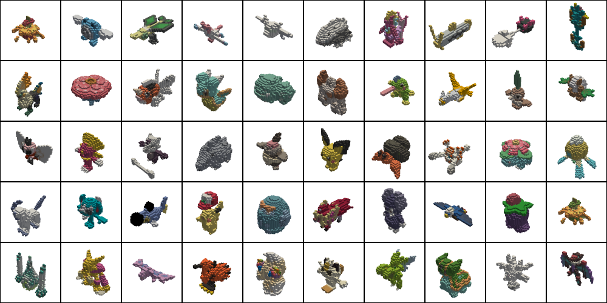
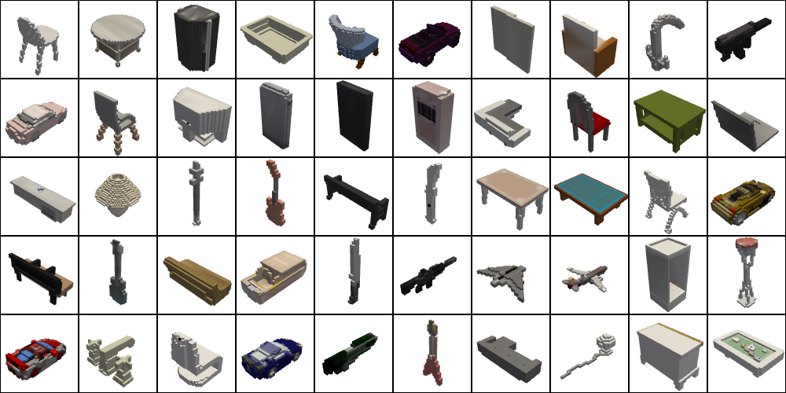
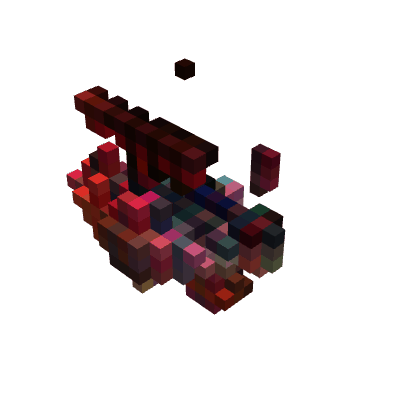
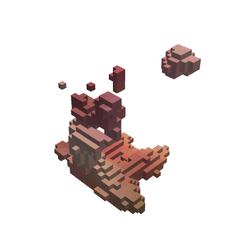







## And probably why nobody tried it before

[Many](https://towardsdatascience.com/i-generated-thousands-of-new-pokemon-using-ai-f8f09dc6477e), [many](https://m.mage.ai/teaching-ai-to-generate-new-pokemon-7ee0ac02c514), [many](https://futurism.com/the-byte/neural-network-pokemon) people have had the idea of ​​generating new pokemon images using artificial intelligence. The franchise has been around for 20 years now, and over 900 pokémons have been created ([with many more to come](https://scarletviolet.pokemon.com/)), which is starting to build a good enough dataset to have fun with. [Some have even had great results using OpenAI's massive Dall-E model and tweaking it for their application.](https://github.com/minimaxir/ai-generated-pokemon-rudalle)

It's great to have images, and it works quite well because the field has been very developed. But with these results it remains difficult to visualize the creatures in space. Is it possible to do the same thing on 3D data ? I wanted to try, and I generated Voxel Art of new pokemons

### Extract pokemons

Before having fun with neural networks, you must first obtain the dataset. Where pokemon images are widespread on the web, and easy to access ([PokeAPI](https://pokeapi.co/)), it is more difficult to obtain and use their 3D models. The best way is to get them directly from the source, in the games. The most recent main game is Pokemon Sword/Shield. Luckily, Nintendo games have a strong community, and thanks to [hactool](https://github.com/SciresM/hactool) and [Pokemon Switch Toolbox](https://github.com/KillzXGaming/Switch-Toolbox), I was able to get and decrypt a Pokemon Shield ROM. Searching in the right folder, I get all the models in .obj format. Then, I coded a script in python which cleans the data and makes it usable, to load it into Pytorch Dataloader. I also added data augmentations, not to be underestimated.

3D meshes are difficult to train on, because the vertices are not ordered on a grid. To be able to use them easily in a network, the meshes are transformed into 3D voxels. Rather than Pixel Art, it becomes Voxel Art. There were other possible options, such as [point clouds, multi-view photos, depth maps…](https://towardsdatascience.com/how-to-represent-3d-data-66a0f6376afb) The biggest advantage of voxels is its ordered nature which facilitates the use of convolutions, the biggest flaw is is that it takes a lot of memory space (cubic function of the resolution).

Here is an example with Squirtle being gradually turned into cubes :

<b>NOTE: This is an interactive 3D representation, you can rotate the model with your cursor</b>

*Squirtle, from left to right : original mesh, 64x64x64 voxels, 32x32x32 voxels, 16x16x16 voxels*

We can also take a look at what our dataset looks like.

*Examples from the pokemon dataset, 32x32x32 voxels*

Our dataset remains very small. To overcome this, I also used [ShapeNet](https://shapenet.org/) to do pre-trainings. ShapeNet is a dataset that contains thousands of 3D models found on the internet, and although it's mostly furniture and vehicles, it can help give the network some intuition about 3D representation at first.

*Examples from the ShapeNet dataset, 32x32x32 voxels*

I trained mostly on small voxel resolutions (16x16x16, 32x32x32) because otherwise it takes a long time on my 8GB RAM GPU, but you can increase the resolution to 64x64x64

### Train neural networks

From these 900 pokémons (+ 900 shiny color variants), we would like to be able to generate others. More than a fun side-project on the games of our childhood, it's also a good way to take a look at the state of the art in terms of synthetic data generation.

###### What do I mean by generating synthetic data ?

We want to create new samples that do not belong to the initial dataset, but that resemble them enough to be part of it. In terms of probabilities, this means that we draw new samples from the same underlying probability distribution of the initial dataset. For distributions that are easy to approximate, a simple linear regression or PCA may be sufficient. When the distributions are more complex, in the case of images or music for example, Deep Learning is the most effective. Aside from creating new pokemon, generating new data is very useful for increasing the size of datasets at a lower cost.

We therefore need generative models, trained in an unsupervised learning way. That's good, there are lots of them, and they work very well. The only problem is that they are all made for images, because quite a few people have worked on 3D voxel representations, because of their limitation in memory size as soon as the resolution is increased. But after all, voxels are to 3D what images are to 2D, right? It is then quite easy to adapt the existing concepts in larger dimensions. We can't use huge pretrained models on huge datasets, since there aren't really any for voxels, so we'll train them from scratch.

##### Generative adversarial networks

The most well-known generative models, which have had impressive results, are the [GANs (Generative adversarial networks)](https://towardsdatascience.com/a-basic-intro-to-gans-generative-adversarial-networks-c62acbcefff3), and therefore are the first ones I tried. There's a [great tutorial on the Pytorch site about a DCGAN trained on CelebA](https://pytorch.org/tutorials/beginner/dcgan_faces_tutorial.html), so I started from their code, adding some extra depth to the model. GANs are not easy to train: you have to stay in a state of equilibrium between the discriminator and the generator, and it is difficult to maintain it. To ensure some stability, I simply trained my network on a resolution of 16x16x16. I followed some of the best practices in training GANs (used OneCycleLR scheduler, with Adam optimizers, a slightly higher learning rate for the discriminator than the generator, spectral and batch normalization). This is the result.

*With such a low resolution, it's going to take some imagination to see pokemon in there.*

##### Variational Autoencoders

Then there are [VAE (variational autoencoders)](https://towardsdatascience.com/understanding-variational-autoencoders-vaes-f70510919f73). Often compared to GAN, VAE are easier to train, but generally give more blurry results. Just like before, I first tried a simple model, found on the [Pytorch VAE github repo](https://github.com/AntixK/PyTorch-VAE). I enlarged it, including adding residual layers. I thought the model would benefit from some pre-training on a dataset larger than 900 pokemon, so I trained it first on ShapeNet, then on the Pokemon dataset. Here is the result, in 32x32x32.

*It's quite messy, but we recognize familiar shapes. Is that a dog in the bottom right?*

##### Explore latent space

Deep Learning is very accurate, but lacks interpretability. Its reasoning process is often referred to as a "black box" for this reason. For the case of GANs and VAEs, they both map voxel data to a latent vector, a compressed array that describes the features of the data. Thus, with these networks, a manipulation often carried out consists in exploring the latent space. It allows you to visualize what is happening under the hood, to see the relationship and proximity between the different voxel shapes. Let's do this.

First for our simple GAN :

*Exploring the GAN latent space*

And then for the VAE :

*Exploring the VAE latent space*

You can also find another simple example on [this Tensorflow tutorial](https://www.tensorflow.org/hub/tutorials/tf_hub_generative_image_module).

##### Diffusion Models

Finally, diffusion models, or score-based models, is an architecture that is less known than GAN and VAE, probably because it is more recent. These models obtained results comparable to GAN on different data generation tasks. The main idea is, rather than modeling the probability distribution, to model the gradient of the probability distribution of the data. For more details, there is [a very well done detailed post on Yang Song's blog](https://yang-song.github.io/blog/2021/score/). I trained one of these models, using an architecture quite similar to the VAE, but optimizing the score criterion, first on ShapeNet, then on the pokemon dataset.

*The score-based model is not doing too badly either*

For now, it's going to be difficult to make my 8-year-old neighbor believe that the big pile of colored cubes I'm showing him is a pokemon, that's for sure. However, despite a mediocre resolution, we recognize things. Deep Learning in 3D is still difficult, but it is an important research topic at the moment. Maybe in the future there will be a time when it will be impossible to "catch them all", because there will be an infinite number of procedurally generated Pokémon.

To improve the result, we would need bigger networks, more data and better data representation. I have also tried to train bigger state of the art models, but without great results. I tried [ProgressiveGAN](https://github.com/tkarras/progressive_growing_of_gans), [NVAE](https://github.com/NVlabs/NVAE) and [LSGM](https://github.com/NVlabs/LSGM) from Nvidia, but there is no point in trying to finetune an architecture that is not suited to the task requested, or to train a complex model on a small dataset

You can access the code I used on [my Github page](https://github.com/le-Greg/generate-voxel-pkmns-with-deep-learning)

Last updated on March 4, 2022
